<!-- ========================= HEADER ========================= -->

<p align="center">
  
</p>

<p align="center">
  <a href="https://memoonch.github.io/memoon/">
    
  </a>
  <a href="https://www.linkedin.com/in/muhammad-memoon-459279268/">
    
  </a>
  <a href="mailto:memoonch@gmail.com">
    
  </a>
  <a href="https://github.com/memoonch?tab=repositories">
    
  </a>
</p>

<p align="center">
  
  
</p>

<br/>

<!-- ========================= ABOUT ========================= -->

## 👨‍💻 About Me

I'm a **Unity Game Developer and Software Engineer** focused on building engaging games, gameplay systems, mobile experiences, and practical software solutions.

🎮 My primary stack is **Unity + C#**, with experience in gameplay programming, physics systems, UI integration, touch/gyroscope controls, optimization, SDK integration, and monetization.

🤖 Alongside game development, I work with **Artificial Intelligence and Machine Learning**, particularly NLP, classification, computer vision, and applied research.

```text
🎮  Unity Game Development      📱  Mobile & Casual Games
💻  Software Engineering        🤖  AI / Machine Learning
🧩  Gameplay Systems            🔬  Computer Science Research
⚡  Optimization                🌐  Software & Web Technologies
```

- 🔭 Currently building **Unity-based gameplay systems and mobile games**
- 🎯 Interested in **Game Development, Software Engineering & Applied AI**
- 🧠 Exploring **AI/ML applications in interactive systems**
- 📄 Published **Machine Learning research through IEEE**
- 🤝 Open to interesting **development and research collaborations**

<br/>

<!-- ========================= TECHNOLOGY ========================= -->

# 🛠️ Technology Arsenal

### 🎮 Game Development

<p align="center">
  
</p>

<p align="center">
  
  
  
  
  
  
</p>

<br/>

### 💻 Programming Languages

<p align="center">
  
</p>

<br/>

### 🤖 AI / Machine Learning

<p align="center">
  
</p>

<p align="center">
  
  
  
  
  
</p>

<br/>

### 🌐 Web, Backend & Databases

<p align="center">
  
</p>

<br/>

### 🔧 Development Tools

<p align="center">
  
</p>

<br/>

<!-- ========================= GAME DEV ========================= -->

# 🎮 Game Development

I enjoy designing gameplay systems that feel **responsive, understandable, polished, and satisfying to interact with**.

My Unity work includes:

<table>
<tr>
<td width="50%" valign="top">

### 🧩 Gameplay Systems

- Gameplay mechanics
- Custom game architecture
- State management
- Level systems
- Physics & collision systems
- Progression systems
- Scoring & combo mechanics

</td>

<td width="50%" valign="top">

### 📱 Mobile Development

- Android development
- Touch input
- Gyroscope controls
- Mobile UI
- Performance optimization
- Ads & monetization
- Third-party SDK integration

</td>
</tr>
</table>

<br/>

<!-- ========================= PROJECTS ========================= -->

# 🚀 Featured Work

<table>
<tr>
<td width="50%" valign="top">

### 🥩 Meat Slice

A **2D physics-based slicing puzzle game** built in Unity.

Players slice polygonal shapes while avoiding moving balls trapped inside the playable area.

**Highlights**

- Custom polygon slicing
- Ball physics
- Collision handling
- Area calculation
- Level progression
- Mobile input
- Dynamic gameplay systems

**Stack**

`Unity` `C#` `2D Physics` `Custom Geometry`

</td>

<td width="50%" valign="top">

### 🍔 Snack Attack

A mobile **ESL educational game** combining interactive gameplay with language learning.

**Highlights**

- Touch & gyro controls
- Word-selection mechanics
- Audio pronunciation
- Combo systems
- Progress tracking
- Mobile UI
- Game feedback systems

**Stack**

`Unity` `C#` `Android` `Gyroscope`

</td>
</tr>
</table>

<p align="center">
  <a href="https://memoonch.github.io/memoon/">
    
  </a>
  &nbsp;
  <a href="https://github.com/memoonch?tab=repositories">
    
  </a>
</p>

<br/>

<!-- ========================= RESEARCH ========================= -->

# 🔬 AI & Machine Learning Research

### 📄 Twitter News Classification Using Machine Learning

Machine-learning research focused on classifying Twitter/X news content using **Natural Language Processing and supervised machine-learning techniques**.

<p>
  
  
  
  
  
</p>

📍 **2024 International Conference on Engineering & Computing Technologies — IEEE ICECT 2024**

**DOI:** `10.1109/ICECT61618.2024.10581173`

<p>
  <a href="https://doi.org/10.1109/ICECT61618.2024.10581173">
    
  </a>
</p>

<br/>

<!-- ========================= GITHUB ANALYTICS ========================= -->

# 📊 GitHub Analytics

<p align="center">
  
</p>

<p align="center">
  
  
</p>

<p align="center">
  
  
</p>

<br/>

<!-- ========================= STREAK ========================= -->

## 🔥 Contribution Streak

<p align="center">
  
</p>

<br/>

<!-- ========================= CONTRIBUTION SNAKE ========================= -->

## 🐍 Contribution Activity

<p align="center">

<picture>
  <source
    media="(prefers-color-scheme: dark)"
    srcset="./assets/github-snake-dark.svg"
  />
  <source
    media="(prefers-color-scheme: light)"
    srcset="./assets/github-snake.svg"
  />
  
</picture>

</p>

<br/>

<!-- ========================= CURRENT FOCUS ========================= -->

# 🎯 Current Focus

```text
┌──────────────────────────────────────────────┐
│                                              │
│   🎮 Unity Gameplay & Game Systems           │
│   📱 Mobile Game Development                 │
│   ⚡ Physics & Performance Optimization      │
│   🤖 Artificial Intelligence                │
│   🧠 Machine Learning                        │
│   🔬 Applied Computer Science Research       │
│                                              │
└──────────────────────────────────────────────┘
```

<br/>

<!-- ========================= COLLABORATION ========================= -->

# 🤝 Let's Build Something

I'm interested in collaborating on:

🎮 **Game Development**  
🤖 **AI / Machine Learning**  
💻 **Software Engineering**  
🔬 **Research Projects**  
🚀 **Interesting Technical Products**

<p align="center">
  <a href="https://www.linkedin.com/in/muhammad-memoon-459279268/">
    
  </a>
  <a href="mailto:memoonch@gmail.com">
    
  </a>
  <a href="https://memoonch.github.io/memoon/">
    
  </a>
</p>

<br/>

<p align="center">
  <b>🎮 Build • Play • Learn • Improve</b>
</p>

<p align="center">
  <i>Thanks for visiting my profile!</i>
</p>

<p align="center">
  
</p>
